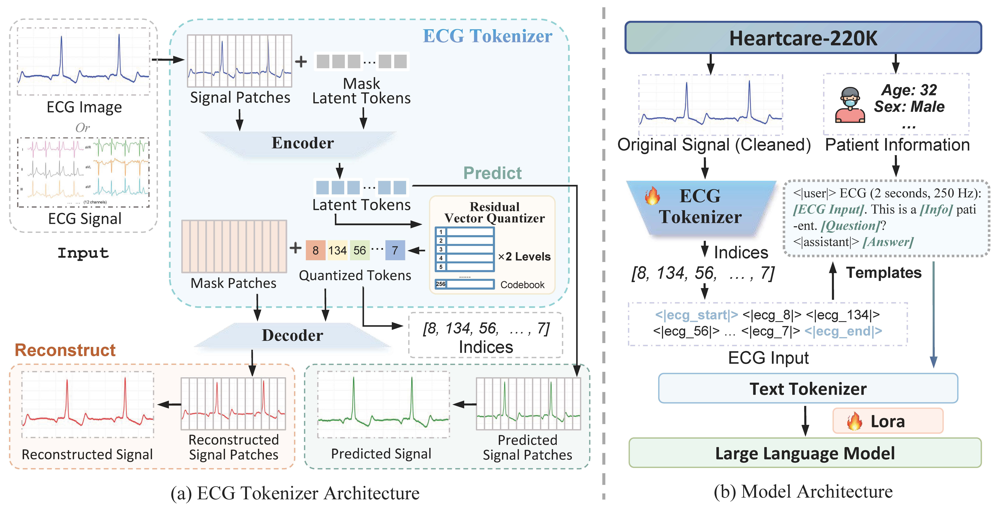

<h1 align = "center">

Heartcare Suite: A Unified Multimodal ECG Suite for Dual Signal-Image Modeling and Understanding 
</h1>

Yihan Xie1, *, Sijing Li1, *, Tianwei Lin1, *, Zhuonan Wang1, *, Chenglin Yang1, Yu Zhong1, Wenjie Yan1, Wenqiao Zhang1, Xiaogang Guo1, Jun Xiao1, Yueting Zhuang1, Beng Chin Ooi2
  

1Zhejiang University,
2National University of Singapore
  

  

Although electrocardiograms (ECG) play a dominant role in cardiovascular diagnosis and treatment, their intrinsic data forms and representational patterns pose significant challenges for medical multimodal large language models (Med-MLLMs) in achieving cross-modal semantic alignment. To address this gap, we propose **Heartcare Suite**, a unified ECG suite designed for dual signal-image modeling and understanding. (i) **Heartcare-400K:** We build a finegrained ECG instruction dataset on top of our data pipeline engine—**HeartAgent**—by integrating 12,170 high quality clinical ECG reports from top hospitals with open-source data; (ii) **Heartcare-Bench:** a systematic benchmark assessing performance of models in multi-perspective ECG understanding and cross-modal generalization, providing guidance for optimizing ECG comprehension models; (iii) **HeartcareGPT:** built upon a structure-aware discrete tokenizer **Beat**, we propose the **DSPA (Dual Stream Projection Alignment)** paradigm—a dual encoder projection alignment mechanism enabling joint optimizing and modeling native ECG signal-image within a shared feature space. Heartcare achieves consistent improvements across diverse ECG understanding tasks, validating both the effectiveness of the unified modeling paradigm and the necessity of a high-quality data pipeline, and establishing a methodological foundation for extending Med-MLLMs toward physiological signal domains.

## Dataset: Heartcare-400K

We construct **Heartcare-400K**, a large-scale, fine-grained, multi-task multimodal ECG instruction dataset. It combines two sources: the public [PTB-XL dataset](https://physionet.org/content/ptb-xl/1.0.3/) with 21,799 12-lead ECG signals annotated with 179 SCP-ECG classes, and 12,170 ECG images with structured reports from top hospitals, including scanned traces, clinical conclusions, and de-identified metadata—substantially enriching modality and label diversity.

To transform heterogeneous ECG data into structured annotations, we develop **HeartAgent**, a multimodal engine with a bottom-up pipeline that ensures annotation consistency and generates high-quality instruction-style VQA pairs.

## Benchmark: Heartcare-Bench

We propose **Heartcare-Bench**, the first fine-grained, multidimensional evaluation framework for ECG diagnostic intelligence, designed to assess a spectrum of model capabilities ranging from feature recognition to reasoning. Built upon Heartcare-400K, Heartcare-Bench systematically covers five major task types—closed-ended QA, open-ended QA, comparative QA, report generation, and signal prediction—spanning key diagnostic dimensions such as rhythm, waveform, and morphology. It comprises three complementary modality subsets: **Signal** (S), **Image** (I), and **Cross-Modal** (C), enabling unified evaluation from single-modality reasoning to multi-ECG semantic alignment. With a hierarchical, multi-metric scoring system, Heartcare-Bench integrates knowledge reasoning and cross-modal understanding within a unified evaluation coordinate.

## Model: HeartcareGPT

We propose **Bidirectional ECG Abstract Tokenization (Beat)**, a hierarchical, structure-aware discrete encoding framework tailored for ECG time-series data. Beat compresses raw ECG signals into token sequences based on vector quantization that can be directly consumed by MLLMs. These discrete representations are directly embedded into the vocabulary of MLLMs, enabling our proposed Med-MLLMs, **HeartcareGPT**, to perform end-to-end reasoning across signals, text, and images.

The dual-form characteristics of ECG introduce unique structural complexity in modeling. We propose **HeartcareGPT**, aiming to build ECG-specific Med-MLLMs. We design **Bidirectional ECG Abstract Tokenization (Beat)**, a structure-aware discrete encoding mechanism centered on vector quantization, which maps high-frequency continuous signals into token sequences. The design comprises three components: (i) *Dual-level Vector Quantization (DVQ)*, which refines rhythm and inter-lead phase dependencies captured by the codebook to achieve high-fidelity compression; (ii) *Query-guided Bidirectional Diffusion (QBD)*, which jointly models past and future contexts within the latent token space to support both signal reconstruction and prediction; and (iii) *Joint Supervision Strategy*, which jointly optimizes reconstruction and prediction to maximize clinical semantic fidelity during encoding. Furthermore, we propose **Dual Stream Projection Alignment (DSPA)**, which employs dual experts to separately process ECG inputs.

Through distinct preprocessing strategies and modality-specific encoders, ECG representations are transformed into embeddings compatible with Med-MLLMs. All modality embeddings are projected into a shared language space and concatenated into a unified sequence, enabling cross-modal joint reasoning for ECG under a unified autoregressive paradigm.
